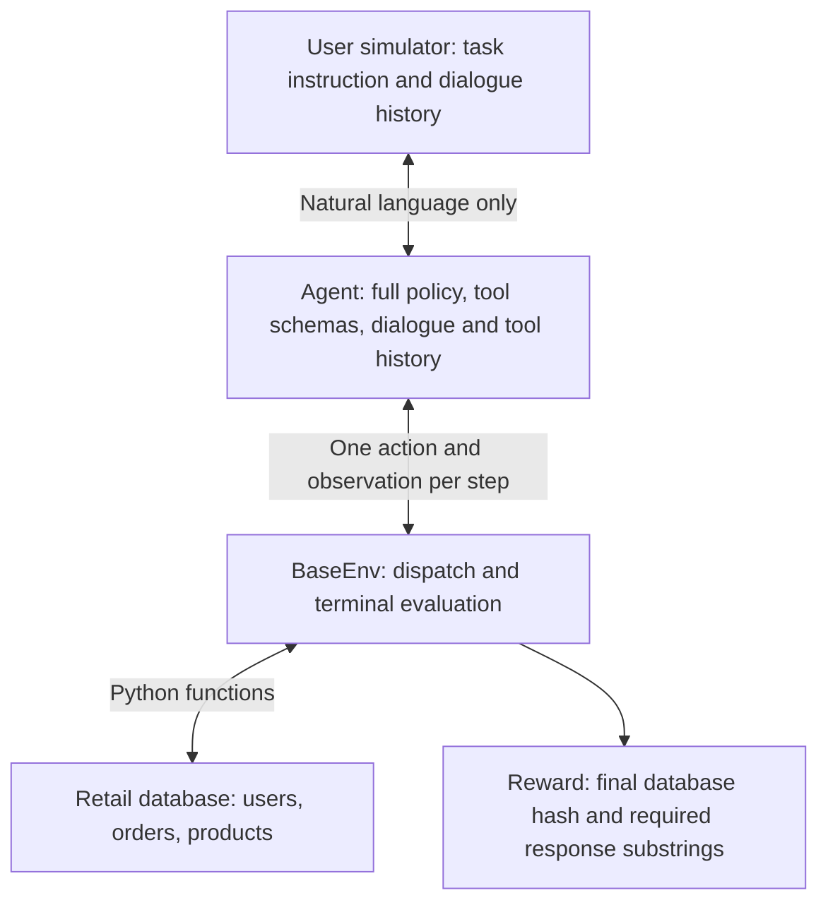

# τ-bench 2024 Architecture

Status: historical-source inspection on 2026-10-05. No live pilot has run. All source references below refer to commit `6f4b718037db619539b8b692060e6686f3f0dcc9`.

## Source map

| Component | File | Important symbols |
|---|---|---|
| CLI and isolated task runner | `run.py` | `main`, `run`, `agent_factory`, nested `_run` |
| Agent interface | `tau_bench/agents/base.py` | `BaseAgent` |
| OpenAI function calling | `tau_bench/agents/gpt_function_calling_agent.py` | `GPTFunctionCallingAgent.act`, `reset`, `get_messages`, `chat_completion_request` |
| Action parsing and serialization | `tau_bench/agents/utils.py` | `message_to_action`, `message_to_dict` |
| ReAct and Act | `tau_bench/agents/chat_react_agent.py` | `ChatReActAgent`, `get_message_action`, `react_instruction`, `act_instruction` |
| User simulator | `tau_bench/envs/user.py` | `NaiveUserSimulationEnv`, `SYSTEM_PROMPT`, `load_user`, `chat_completion_request` |
| Environment and evaluator | `tau_bench/envs/base.py` | `BaseEnv.reset`, `step`, `calculate_reward`, `get_data_hash`, `to_hashable`, `consistent_hash` |
| Retail environment | `tau_bench/envs/retail/__init__.py` | `MockRetailDomainEnv` |
| Agent policy | `tau_bench/envs/retail/wiki.md`, `wiki.py` | `wiki` |
| Auxiliary rules | `tau_bench/envs/retail/rules.py` | `rules` (stored, not separately applied by reward) |
| Tool registration | `tau_bench/envs/retail/tools/__init__.py` | `tools`; each function has `__info__` schema |
| Task sets | `tau_bench/envs/retail/tasks.py`, `tasks_dev.py`, `tasks_train.py` | `tasks` |
| Database | `tau_bench/envs/retail/data/__init__.py`, `users.json`, `orders.json`, `products.json` | `data` |

## Agent visibility and choice

At episode start, `reset` places the entire retail policy in the agent's system message. `env.reset` generates the first simulated user utterance, which becomes its first user message. Tools are supplied through the API's `tools` argument. The agent does not receive the task instruction, gold actions, expected outputs, task user ID, or full backend state. Although `env.reset` returns the task in `info`, the GPT agent does not place that dictionary in its model context.

The agent sees all prior user messages, its own responses, and executed tool results. `tool_choice='auto'` lets it choose speech or a tool call. Only the first returned tool call is parsed and executed; subsequent parallel calls are discarded. Speech is encoded as the environment action `respond`. A model message containing both speech and tool calls is treated as a tool call; its speech is not delivered to the simulator.

The loop has 30 agent actions, including both speech and tool calls. Several tool calls may occur consecutively without consulting the user. `think` is removed unless function calling is selected with `--think 1`. ReAct uses `--agent_strategy react --think 1`; without thinking it uses the Act prompt. Other provider-specific agents have separate files; this audit targets the original OpenAI function-calling baseline.

## User simulator

The historical runner hardcodes `user_mode='naive'`. `load_user` also supports a human input mode, but the runner exposes no user-mode option. Later `llm`, `react`, `verify`, and `reflection` simulator options are absent.

`NaiveUserSimulationEnv.reset` supplies only the task's free-form `instruction`, the simulator rules, and a fixed greeting. There are no structured known/unknown information fields. Every subsequent request includes its entire own dialogue history. In its internal representation the service agent's speech has role `user`, and generated customer speech has role `assistant`.

It does not see backend data, tool schemas, policy, tool calls/results, gold actions, or outputs. If the service agent repeats a tool result in ordinary speech, it becomes visible indirectly. The instruction includes identity, preferences, personality, conditional goal changes, and selected facts; the separate task `user_id` is not automatically passed to it.

The prompt tells it to provide information needed for the current step, avoid giving everything at once, avoid inventing missing information, and say it does not remember/have an unspecified order ID. It may volunteer facts and refuse disclosure according to the instruction. These are probabilistic prompt constraints, without validation or a structured fact store; hallucination or inconsistent refusals remain possible. No pilot observations yet establish their frequency. User sampling is temperature 1.0 and `max_tokens=150`.

It terminates by emitting exactly `###STOP###`. Additional text or whitespace prevents the historical exact-string termination check. Transfer to a human agent also terminates the environment.

## One action lifecycle

1. The GPT agent submits its persistent history, policy, and tool schemas to Chat Completions.
2. `chat_completion_request` validates JSON syntax for the first tool call. `message_to_action` converts that call, or agent speech, into an action dictionary.
3. `BaseEnv.step` validates action shape and appends it to `self.actions`.
4. For `respond`, the simulator samples a customer message. For a registered tool, the Python function reads or mutates `self.data`; errors become textual observations. Unknown names also become observations.
5. The agent appends its speech and customer reply, or the call and tool observation, to history.
6. Exact customer STOP or the transfer tool invokes `calculate_reward`. Otherwise another action is sampled, up to 30. Exhausting the limit leaves reward zero without invoking terminal evaluation.
7. `run._run` saves `task_id`, `reward`, `info`, `traj`, and `trial` in JSON. It records caught execution exceptions as reward zero.

## Backend information and tools

All registered tool files are under `tau_bench/envs/retail/tools/`, with filenames matching the functions below.

| Kind | Functions |
|---|---|
| Database reads | `find_user_id_by_email`, `find_user_id_by_name_zip`, `get_user_details`, `get_order_details`, `get_product_details`, `list_all_product_types` |
| Database writes (7) | `cancel_pending_order`, `exchange_delivered_order_items`, `modify_pending_order_address`, `modify_pending_order_items`, `modify_pending_order_payment`, `modify_user_address`, `return_delivered_order_items` |
| Other non-writing actions | `calculate`, `transfer_to_human_agents`; optional `think` |

There are 16 registered functions, 15 normally exposed after filtering `think`. This explains the paper's 7 write + 8 non-write tool count.

The 500 user profiles contain names, email, address (including ZIP), saved payment methods and order IDs. The 1,000 orders contain status, shipping address, ordered items, fulfillment/tracking information and payment history. The 50 products contain variants, options, availability and prices. `get_user_details` returns the entire matching profile; `get_order_details` and `get_product_details` return their corresponding records.

Names/email/ZIP and existing addresses can therefore come from either user instructions or backend queries. Order IDs need not be remembered by the user: the authenticated profile lists them. New preferences, intent, cancellation reasons, a previously unstored destination, and explicit permission typically come from the conversation; there is no universal required-human-information schema. Some tasks explicitly request reuse of a stored address rather than its disclosure.

Authentication is a policy requirement, not an explicit environment flag or access-control gate. Lookup uses either email or name + ZIP; the latter tool's description says use email by default and fall back if email fails or is forgotten. The policy requires lookup even when the user provides a user ID. Once lookup succeeds, it does not prescribe an additional identity challenge. Tool functions can technically be called without prior authentication, and scoring does not verify that lookup occurred.

## Policy procedures

- Authenticate at the beginning; serve one customer, allowing multiple requests for that customer.
- Describe consequential updates and obtain explicit confirmation before executing them. These conversational rules are not independently checked by reward.
- Cancel only pending orders; confirm order and one of two reasons (`no longer needed`, `ordered by mistake`). Refund original payments; gift card balances update immediately, other refunds take 5–7 business days per policy.
- Modify only pending orders: shipping address, payment method, or item options. Payment must use a different single method; gift cards need sufficient balance. Item modifications must stay within the same product and use available variants, with a payment method for the difference. Collect all items before this one-use operation, which changes status to `pending (items modifed)` (historical spelling).
- Return only delivered orders, confirming order, items, and refund method. Refund to the original method or an existing gift card; status becomes `return requested` and the policy promises email instructions.
- Exchange only delivered orders, to available variants of the same product. Collect all items in one operation and select payment/refund method for the difference. Status becomes `exchange requested`; no new order is placed.
- Default profile address and pending-order shipping address use separate tools; there is no dedicated additional address policy section. Tools require all six address components and descriptions require confirmation.
- Transfer only requests outside available actions; perform at most one tool call per action and do not deliver speech at the same time.

## Exact scoring path

`GPTFunctionCallingAgent.act → BaseEnv.step(done=True) → BaseEnv.calculate_reward → run._run → main`.

The evaluator starts at reward 1. If `outputs` exists, each required substring must occur in at least one agent `respond` action, using case-insensitive matching after removing commas from the response. The match can be anywhere in agent speech, not just the last reply. No LLM judge checks meaning or factual consistency.

It hashes the complete agent-final database through recursive normalization and SHA-256. If `actions` exists, it replaces `self.data` with a deep copy of the initial database, replays the gold actions except termination tools, hashes that resulting database, and requires equality. Dictionary keys are sorted; list order remains significant. Missing an output substring or unequal database hashes makes reward zero. Intermediate agent actions are not compared with the gold sequence. Different dialogues/read sequences and equivalent write sequences can succeed.

Important historical behavior: gold replay calls `self.step`, appending gold actions to `self.actions`; however, the `info['actions']` list was captured before replay. The environment's database is left at the gold state after evaluation. It is therefore unsafe to label a post-evaluation `env.data` snapshot as the agent-final state. Capture the pre-evaluation state in an external audit harness if execution proceeds; do not change the evaluator.

API calls retry up to 10 times with exponential random waits. GPT JSON parsing errors inside the request wrapper are retried too. Exhausted API/user errors during `act` are caught by `run._run` and assigned reward zero with a partial trajectory. Environment/tool exceptions usually become tool observations and allow continuation. Invalid action shape raises. Environment and agent construction occur outside `_run`'s `try`, so setup failures may abort the runner instead of producing task records. The historical cost dictionaries can also raise for otherwise supported model identifiers.

The printed aggregate is `sum(rewards)/len(results)`. With equal trials per task it equals pass^1. The paper's pass^k estimate is the task mean of `C(c,k)/C(n,k)`, for k ≤ n, where c is successes among n trials. It estimates all k trials succeeding, unlike pass@k. No pass^k aggregation implementation exists at this initial commit; one was added July 28.

## Trajectory provenance and limitations

GPT trajectories distinguish user speech (`role=user`), agent speech (`role=assistant`, content), tool calls (`role=assistant`, `function_call` string), and tool outputs (`role=tool`, name/content). This mechanically identifies the message source. It does not establish whether the same fact was already known or available elsewhere, nor provide fact-level provenance.

`message_to_dict` serializes tool calls as Python-object strings rather than structured JSON arguments and drops the original assistant call ID. Tool outputs retain `tool_call_id`. Readable call arguments survive in the string, but robust parsing and replay will require care. The trajectory does not include the user system instruction, full simulator history, or final database snapshot; these must be preserved separately for a complete record. No instrumentation or research metric has been added.

## Offline verification evidence

After the source audit, eleven controlled checks against the unchanged evaluator passed (`evidence/offline-verification.json`). Gold replay of all 115 tasks produced tool errors in 22 definitions, including intentional failed reads and historically invalid writes. A failed gold write can silently define a no-op target state because the replay uses ordinary environment error handling. These records are not LLM trajectories or measured agent success. See `REPRODUCTION_NOTES.md` for affected IDs and interpretation.
